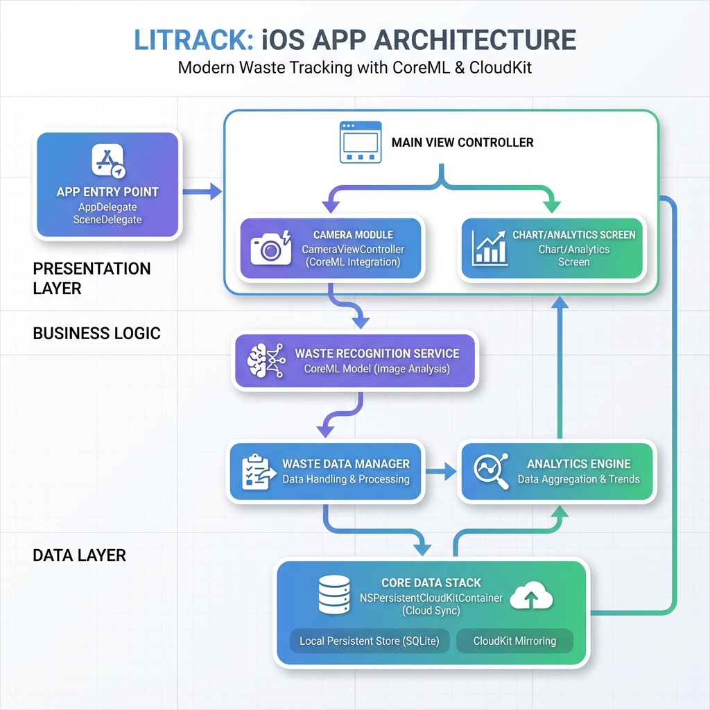
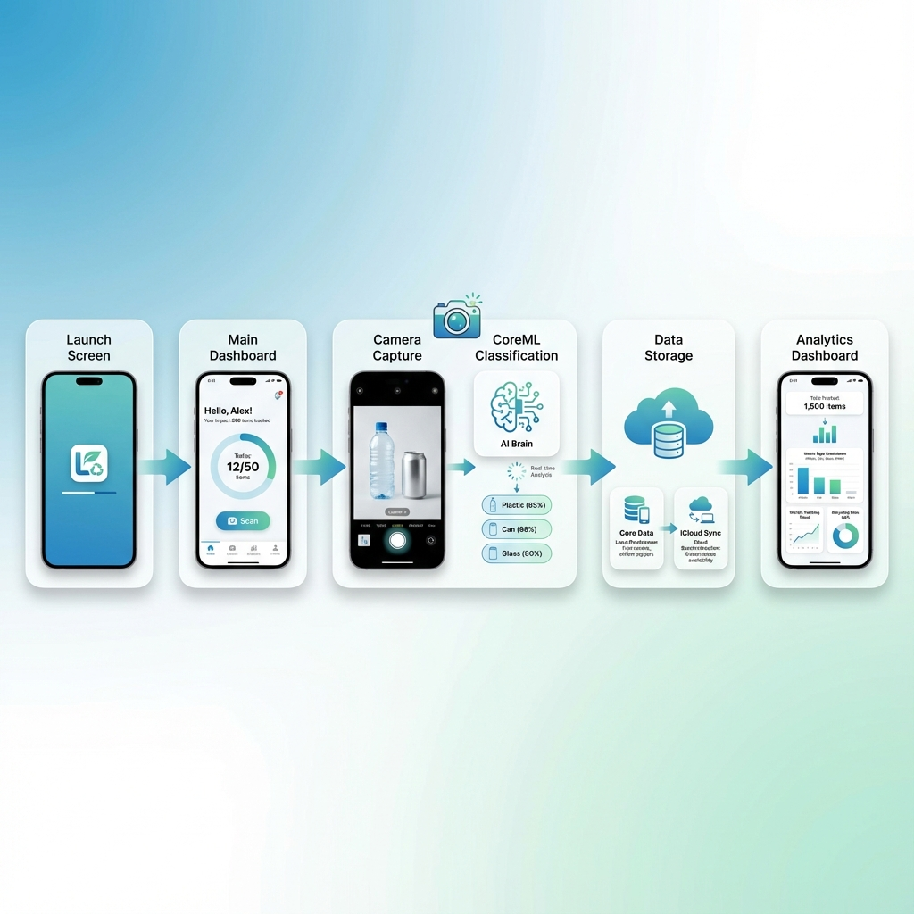
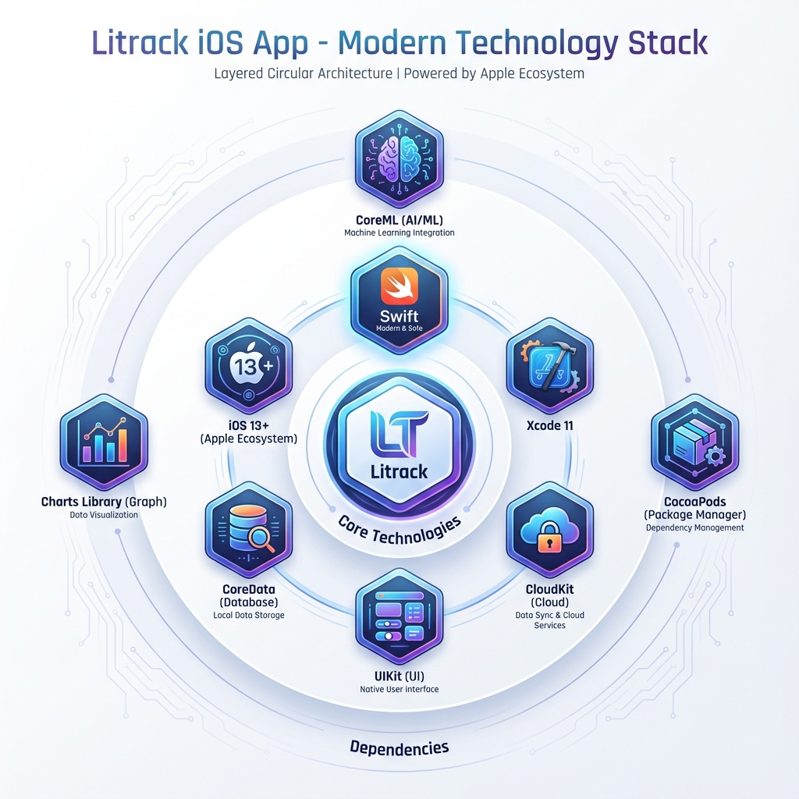

<div align="center">

# Litrack

### *Smart Waste Tracking with AI*

[](https://developer.apple.com/swift)
[](https://www.apple.com/ios)
[](https://developer.apple.com/xcode)
[](LICENSE)

**An intelligent iOS application that leverages CoreML and CoreData to track and classify plastic, can, and glass waste, helping users make environmentally conscious decisions.**

[Features](#-features) • [Architecture](#-architecture) • [Tech Stack](#-tech-stack) • [Installation](#-installation) • [Team](#-team)

---

</div>

## Overview

Litrack is a cutting-edge iOS application designed to combat environmental pollution by empowering users to track and manage their waste disposal habits. Using advanced machine learning capabilities through CoreML, the app can automatically identify and classify different types of recyclable materials, making waste management smarter and more efficient.

### Key Highlights

- **AI-Powered Classification** - Automatically identify plastic, cans, and glass using CoreML
- **Visual Analytics** - Track your waste disposal patterns with beautiful charts
- **Cloud Sync** - Seamlessly sync data across devices with iCloud integration
- **Smart Camera** - Capture and classify waste items in real-time
- **Persistent Storage** - Reliable local data storage with CoreData

---

## Features

### Real-time Waste Detection
Utilize your device's camera to instantly identify and classify waste materials using advanced CoreML models. The app processes images on-device for privacy and speed, providing immediate feedback on waste type classification.

**Technical Details:**
- On-device CoreML inference
- Real-time image processing
- Support for Plastic, Can, and Glass classification
- Privacy-focused (no data sent to servers)

### Analytics Dashboard
Visualize your waste tracking data with interactive charts powered by the Charts library. Understand your environmental impact through beautiful visualizations that show your recycling patterns over time.

**Features Include:**
- Interactive bar, line, and pie charts
- Historical data analysis
- Waste type distribution
- Tracking trends and patterns

### iCloud Synchronization
Keep your waste tracking data synchronized across all your Apple devices with NSPersistentCloudKitContainer. Your data is automatically backed up and available wherever you need it.

**Benefits:**
- Automatic cross-device sync
- Secure cloud backup
- Conflict resolution
- Seamless data migration

### Intuitive Interface
Clean, modern UI built with UIKit, providing a seamless user experience for waste tracking and management. The interface is designed to be simple yet powerful, making waste tracking effortless.

**Design Principles:**
- User-friendly navigation
- Clear visual feedback
- Accessible design
- Consistent iOS patterns

---

## Architecture

<div align="center">

### Application Architecture Diagram



*The app follows the MVC (Model-View-Controller) pattern with clear separation of concerns across presentation, business logic, and data layers.*

</div>

### Architecture Layers

#### **Presentation Layer**
- `ViewController` - Main application interface
- `CameraViewController` - Camera capture and ML classification
- Storyboards - UI layouts and navigation flows

#### **Business Logic Layer**
- CoreML Models - Waste classification intelligence
- View Controllers - Application flow control
- Data transformation and validation

#### **Data Layer**
- CoreData Stack - Local persistence
- CloudKit Container - Cloud synchronization
- Data models and entities

---

## Feature Flow

<div align="center">

### User Journey Flow



*From launch to analytics: A complete user journey through the Litrack application.*

</div>

### Flow Breakdown

1. **Launch** → User opens the app and sees the main dashboard
2. **Capture** → Camera captures waste item for classification
3. **Classify** → CoreML model identifies the waste type (Plastic/Can/Glass)
4. **Store** → Data is saved to CoreData and synced with iCloud
5. **Analyze** → View tracking statistics and charts

---

## Tech Stack

<div align="center">

### Technology Stack Visualization



*A comprehensive view of all technologies powering Litrack.*

</div>

### Core Technologies

| Technology | Purpose | Version |
|------------|---------|---------|
| **Swift** | Primary programming language | 5.0+ |
| **iOS** | Target platform | 13.0+ |
| **Xcode** | Development environment | 11+ |

### Frameworks & Libraries

| Framework | Purpose |
|-----------|---------|
| **CoreML** | Machine learning and waste classification |
| **CoreData** | Local data persistence |
| **CloudKit** | iCloud synchronization |
| **UIKit** | User interface components |
| **Charts** | Data visualization and analytics |

---

## Installation

### Prerequisites

- macOS with Xcode 11 or later
- iOS 13.0+ deployment target
- Apple Developer account (for device testing)

### Setup Instructions

1. **Clone the repository**
   ```bash
   git clone https://github.com/elmeeee/Litrack-MC2.git
   cd Litrack-MC2
   ```

2. **Open project**
   ```bash
   open Litrack-MC2.xcodeproj
   ```

3. **Build and Run**
   - Select your target device or simulator
   - Press `Cmd + R` to build and run

---

## Usage

### Quick Start Guide

1. **Launch the App** - Open Litrack on your iOS device
2. **Grant Permissions** - Allow camera access for waste detection
3. **Capture Waste** - Use the camera to photograph recyclable items
4. **View Classification** - See AI-powered waste type identification
5. **Track Progress** - Monitor your waste tracking in the analytics dashboard

---

## Project Structure

<div align="center">


*Visual representation of the Litrack project organization*

</div>

```
Litrack-MC2/
├── Litrack-MC2/                   # Main source code directory
│   ├── AppDelegate.swift           # App lifecycle management
│   ├── SceneDelegate.swift         # Scene configuration
│   ├── LitrackApp.swift            # SwiftUI app entry point
│   ├── DataController.swift        # CoreData stack management
│   ├── Core/                       # Core app components
│   │   └── App/                    # App-level configurations
│   ├── Features/                   # Feature modules
│   ├── Views/                      # SwiftUI views
│   │   ├── ContentView.swift       # Main content view
│   │   ├── HomeView.swift          # Home screen
│   │   ├── HistoryView.swift       # History tracking
│   │   └── SettingsView.swift      # App settings
│   ├── Models/                     # Data models
│   ├── Shared/                     # Shared utilities and components
│   ├── Camera/                     # Camera & ML integration
│   ├── Assets.xcassets/            # App assets and images
│   ├── Base.lproj/                 # Localization resources
│   │   ├── Main.storyboard         # Main UI layout
│   │   └── LaunchScreen.storyboard # Launch screen
│   └── Litrack_MC2.xcdatamodeld/   # CoreData model
├── Litrack-MC2.xcodeproj/         # Xcode project file
├── Litrack-MC2Tests/              # Unit tests
├── Litrack-MC2UITests/            # UI tests
├── docs/                          # Documentation and diagrams
├── .gitignore                     # Git ignore rules
└── README.md                      # This file
```

---

## Design Principles

### User-Centric Design
The app is built with the user in mind, featuring:
- **Intuitive Navigation** - Easy to understand flow from capture to analysis
- **Clear Visual Feedback** - Immediate confirmation of actions and classifications
- **Minimal Learning Curve** - Get started tracking waste in seconds
- **Accessible to All** - Designed following iOS accessibility guidelines

### Performance Optimization
Ensuring smooth and efficient operation:
- **Fast App Launch** - Optimized initialization and resource loading
- **Smooth Animations** - 60 FPS UI transitions and interactions
- **Efficient Memory Usage** - Careful resource management
- **Battery Conscious** - Optimized ML inference and background operations

### Privacy & Security
Your data stays yours:
- **On-Device Processing** - ML models run locally on your device
- **Secure iCloud Sync** - End-to-end encryption for cloud data
- **No Data Sharing** - Your waste tracking data is never shared
- **User Data Protection** - Compliance with iOS privacy standards

### Sustainability Focus
Making a positive environmental impact:
- **Promote Recycling Habits** - Encourage consistent waste tracking
- **Environmental Awareness** - Educate users about their impact
- **Track Positive Impact** - Visualize your contribution to sustainability
- **Eco-Friendly Behavior** - Gamify and reward green actions

---

## Technical Specifications

### Minimum Requirements
- **iOS Version**: 13.0 or later
- **Device**: iPhone 6s or newer
- **Storage**: 50 MB free space
- **Permissions**: Camera access

### Recommended
- **iOS Version**: 14.0 or later
- **Device**: iPhone 8 or newer
- **Storage**: 100 MB free space
- **Account**: iCloud account for synchronization

### Development Environment
- **macOS**: Catalina (10.15) or later
- **Xcode**: 11.0 or later
- **Swift**: 5.0 or later

---

## Roadmap

- [ ] **Enhanced ML Models** - Improve classification accuracy
- [ ] **More Waste Types** - Add support for paper, metal, and organic waste
- [ ] **Social Features** - Share achievements and compete with friends
- [ ] **Gamification** - Reward system for consistent tracking
- [ ] **Widget Support** - iOS 14+ home screen widgets
- [ ] **Dark Mode** - Full dark mode support
- [ ] **Localization** - Multi-language support

---

## Known Issues

Currently, there are no known issues. If you encounter any problems, please [open an issue](https://github.com/elmeeee/Litrack-MC2/issues).

---

## Team

<div align="center">

### Meet the Creators

</div>

<table>
<tr>
<td align="center" width="20%">
<br />
<sub><b>Elmee</b></sub><br />
<i>Developer | Python | CoreML</i><br />
<a href="https://github.com/elmeeee">💻</a>
<a href="https://www.linkedin.com/in/sufiandyelmy/">💼</a>
</td>

<td align="center" width="20%">
<br />
<sub><b>Karina Widyastuti</b></sub><br />
<i>Swift | Python | CoreData</i><br />
<a href="https://github.com/kwidyas">💻</a>
<a href="https://www.linkedin.com/in/karinawidyastuti/">💼</a>
<a href="https://twitter.com/karinwidya13">🐦</a>
<a href="https://www.instagram.com/">📷</a>
</td>

<td align="center" width="20%">
<sub><b>H.A.I.N Wahyoe</b></sub><br />
<i>Design | Project Manager</i><br />
<a href="https://www.linkedin.com/in/askwhy/">💼</a>
<a href="https://www.instagram.com/">📷</a>
</td>

<td align="center" width="20%">
<sub><b>Vioni Febiyanti</b></sub><br />
<i>Design | Keynote Speaker</i><br />
<a href="https://www.linkedin.com/in/vioni-febiyanti-1b93891b1/">💼</a>
<a href="https://dribbble.com/Febiyanti">🎨</a>
<a href="https://www.instagram.com/vionifebiyanti_uiux/">📷</a>
</td>

<td align="center" width="20%">
<sub><b>Adlia Nailul Afifah</b></sub><br />
<i>Design | Keynote Speaker</i><br />
<a href="https://www.youtube.com/channel/UCDXR4w6kZo0yX1j5tASzLxg">📺</a>
<a href="https://www.instagram.com/anafifah42/">📷</a>
</td>
</tr>
</table>

---

## Environmental Impact

Litrack contributes to environmental sustainability by:

- **Raising Awareness** - Helping users understand their waste patterns and recycling habits
- **Promoting Recycling** - Making it easy to track and identify recyclable materials
- **Data-Driven Decisions** - Providing insights for better waste management practices
- **Community Building** - Connecting eco-conscious individuals (future feature)
- **Positive Habits** - Encouraging consistent recycling behavior through tracking

By using Litrack, you're taking an active role in reducing environmental pollution and promoting a more sustainable future.

---

## Additional Resources

### Documentation
- [Apple CoreML Documentation](https://developer.apple.com/documentation/coreml) - Learn about machine learning on iOS
- [CoreData Programming Guide](https://developer.apple.com/library/archive/documentation/Cocoa/Conceptual/CoreData/) - Master data persistence
- [CloudKit Documentation](https://developer.apple.com/documentation/cloudkit) - Understand cloud synchronization
- [Charts Library GitHub](https://github.com/danielgindi/Charts) - Explore data visualization options

### Learning Resources
- [Swift Programming Language Guide](https://docs.swift.org/swift-book/) - Official Swift documentation
- [iOS Human Interface Guidelines](https://developer.apple.com/design/human-interface-guidelines/ios) - Design best practices
- [Machine Learning Best Practices](https://developer.apple.com/machine-learning/) - Apple's ML resources

---

## License

This project is licensed under the MIT License - see the [LICENSE](LICENSE) file for details.

---

## Acknowledgments

- Apple for CoreML and CoreData frameworks
- [Charts](https://github.com/danielgindi/Charts) library for beautiful visualizations
- The open-source community for inspiration and support

---

<div align="center">

### Star this repository if you find it helpful!

**Made with ❤️ for a greener planet 🌍**

[Back to Top](#-litrack)

</div>
